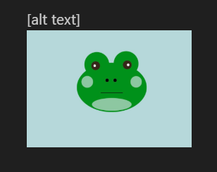

# Markdown
## Markdown
laba diena su vištiena
## sąrašas
- **_agurkas_**
## bold ir Italic
**labas rytas**
## Nuorodos
Github: [mano profilis](https://github.com/kornelyte12)
## Nuotrauka

[alt text]

[alt text]
